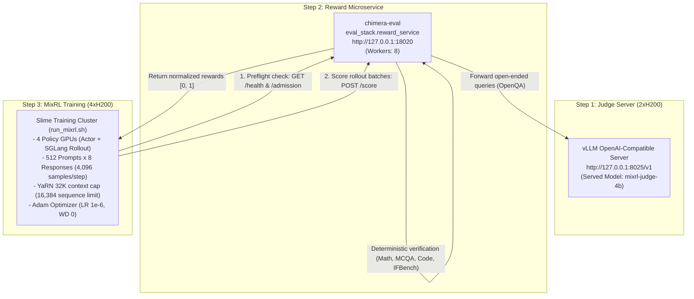

# Chimera 10B Adam MixRL: Airgapped / Offline Run Guide

This guide describes how to run Chimera 10B Adam MixRL on an **airgapped / no-internet** multi-GPU machine using local volume mounts, the pre-hosted vLLM judge, and the unified entrypoint script [`run_mixrl.sh`](run_mixrl.sh).

---

## 1. Architecture & Service Topology

In an airgapped environment, no external internet access or Hugging Face Hub calls are made. All services communicate over local sockets (`127.0.0.1`):



---

## 2. Prerequisites & Volume Mounts

Before starting, ensure the following local filesystem directories are prepared on the host machine:

| Host Directory | Container Mount Path | Description |
| :--- | :--- | :--- |
| `/data/models` | `/data/models` | SFT iter 3478 weights (`{hf, mcore}`) and judge weights |
| `/data/datasets` | `/data/datasets` | `chimera-eval-data` with `manifest.json`, splits, and audits |
| `/data/runs` | `/data/runs` | Checkpoints, tensorboard, and run manifests output directory |
| `/data/repos/slime` | `/workspace/slime` | This repository (containing `run_mixrl.sh`) |
| `/data/repos/transformers` | `/workspace/transformers` | Pinned Chimera Transformers package |
| `/data/repos/chimera-eval` | `/workspace/chimera-eval` | Evaluator repository with `reward_service.py` |

---

## 3. Step-by-Step Launch Procedure

### Step 1: Verify the Local Judge Server
The judge model is assumed to already be running on 2×H200 GPUs at port `8025`:

```bash
# Verify judge readiness:
curl -s http://127.0.0.1:8025/v1/models | jq .
```
*(Ensure `mixrl-judge-4b` is listed in the response).*

---

### Step 2: Start the Reward Microservice (`eval_stack.reward_service`)
The reward microservice bridges Slime rollouts with both deterministic evaluation graders and the local vLLM judge.

From the `chimera-eval` directory, start the reward service in the background:

```bash
cd /workspace/chimera-eval

export JUDGE_URL=http://127.0.0.1:8025/v1
export JUDGE_NAME=mixrl-judge-4b
export JUDGE_CONTEXT=16384
export JUDGE_MAX_TOKENS=1024
export JUDGE_MAX_RETRY_TOKENS=2048
export JUDGE_CONCURRENCY=8
export JUDGE_CHAT_TEMPLATE_KWARGS='{"enable_thinking":false}'

python3 -m eval_stack.reward_service \
  --data-dir /data/datasets/chimera-eval-data \
  --cache-dir /data/cache/scorer_cache \
  --host 127.0.0.1 \
  --port 18020 \
  --workers 8 \
  --judge-revision "mixrl-judge-4b" &
```

**Verify Reward Service Readiness:**
```bash
curl -s http://127.0.0.1:18020/health
# Expected: {"protocol_id": "...", "status": "ready"}
```

---

### Step 3: Run the Training Container

Launch the pinned Slime Docker container with 4 dedicated training GPUs (e.g. devices 0, 1, 2, 3), host networking, and mounted volumes:

```bash
docker run --gpus '"device=0,1,2,3"' \
  --ipc=host \
  --net=host \
  --ulimit memlock=-1 \
  --ulimit stack=67108864 \
  -v /data/models:/data/models \
  -v /data/datasets:/data/datasets \
  -v /data/runs:/data/runs \
  -v /data/repos/slime:/workspace/slime \
  -v /data/repos/transformers:/workspace/transformers \
  -w /workspace/slime \
  -it suryavikram6/slime:pinned bash
```

---

### Step 4: Launch Training via `run_mixrl.sh`

Inside the container, run:

```bash
bash run_mixrl.sh
```

The script will:
1. Enforce airgapped environment flags (`HF_HUB_OFFLINE=1`, `TRANSFORMERS_OFFLINE=1`).
2. Verify all model weights, tokenizer configs, and dataset manifests exist locally.
3. Perform a handshake with `http://127.0.0.1:18020/health`.
4. Validate 4 visible CUDA GPUs.
5. Initialize Ray and dispatch the 512-prompt $\times$ 8-response training pipeline across all 16 domains.

---

## 4. Execution Modes & Configuration Overrides

You can modify variables at the top of [`run_mixrl.sh`](run_mixrl.sh), or provide command-line environment overrides:

### A. Preflight / Dry-Run (No GPU execution)
To verify all paths, generate manifests, check patches, and inspect the exact Megatron training command without allocating VRAM:
```bash
DRY_RUN=1 bash run_mixrl.sh
```

### B. Resuming an Interrupted Run
To resume exact optimizer, scheduler, and route sampling state from a previous checkpoint:
```bash
RESUME=1 RUN_NAME=my-previous-run-name bash run_mixrl.sh
```

### C. Overriding Paths or Hyperparameters
```bash
NUM_ROLLOUT=200 \
EVAL_INTERVAL=20 \
DATA_ROOT=/custom/mount/path \
bash run_mixrl.sh
```

---

## 5. Monitoring & Outputs

While training is running, artifacts and metrics are written to `$RUNS_ROOT/$RUN_NAME/`:

* **TensorBoard:**
  ```bash
  tensorboard --logdir /data/runs/RUN_NAME/tensorboard --port 6006
  ```
* **Hardware Telemetry:**
  `$RUNS_ROOT/$RUN_NAME/logs/gpu_metrics.csv` records GPU utilization, memory usage, and power draw every 5 seconds.
* **Evaluation Summaries:**
  Every `EVAL_INTERVAL` boundaries, quick evaluation evaluates 128 prompts from `rl_val` (pass@4). Results and domain breakdowns are logged to terminal and saved in `$RUNS_ROOT/$RUN_NAME/rollouts/`.
