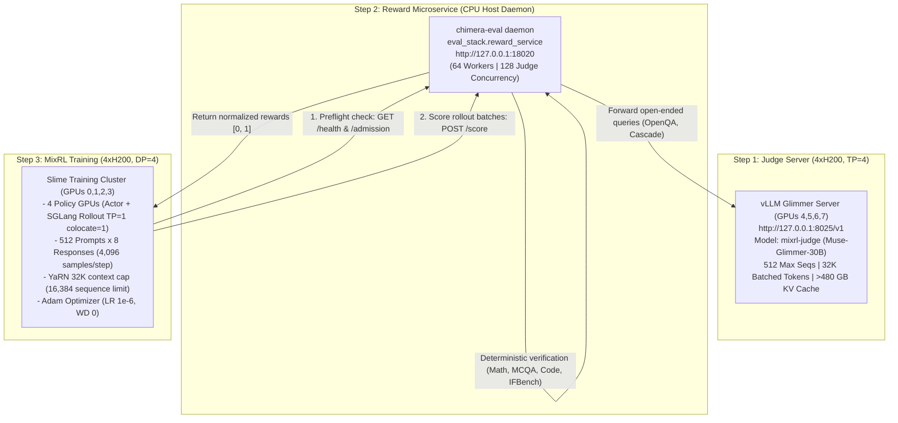

# Chimera 10B Adam MixRL: Airgapped / Production Run Guide

This guide provides the complete, turn-key instructions for launching Chimera 10B Adam MixRL on an **airgapped / no-internet** multi-GPU machine. All paths, scripts, and container mounts are prebaked for the production filesystem root:

```
/nvme_zone3/home/ekamai1/chimera/mixrl
```

---

## 1. Architecture & Service Topology

In an airgapped environment, no external internet access or Hugging Face Hub calls are made. All inter-service communications execute over local network sockets (`127.0.0.1`):



### 8-GPU Node Allocation: Why 4 GPUs Training + 4 GPUs Judge is Fastest

On a node with **8×H200 (141 GB VRAM each, 1,128 GB total)**, partitioning the machine into **4 GPUs Training (GPUs 0,1,2,3) + 4 GPUs Judge (GPUs 4,5,6,7)** is mathematically optimal and delivers the highest aggregate throughput:

1. **Exact Batch Divisibility for Distributed Training**:
   * Global prompt batch size = **512 prompts** $\times$ 8 responses = 4,096 samples per step.
   * With **4 policy GPUs (DP=4)**:
     $$\frac{512 \text{ prompts}}{4} = 128 \text{ prompts/GPU} \quad \text{and} \quad \frac{4,096 \text{ responses}}{4} = 1,024 \text{ rollouts/GPU}$$
   * Both divide cleanly into whole integers without remainder. Megatron data parallel requires `global_batch % dp == 0`. An allocation of 6 GPUs would break ($512 / 6 = 85.333$), forcing uneven batches or dropped samples.
   * All-reduce communication over 4 ranks forms a power-of-two NVLink ring/tree, achieving peak NVLink bandwidth efficiency (~900 GB/s bidirectional per GPU).

2. **Actor + SGLang Colocation Memory Headroom**:
   * On GPUs 0–3, Chimera 10B Megatron Actor + SGLang Rollout engine runs in colocated mode (`colocate=1`).
   * Total active VRAM stabilizes around **~82 GiB / 141 GiB**, leaving **~59 GiB free headroom per GPU** for dynamic KV allocations during generation.

3. **Massive KV Cache Pool for Judge Concurrency**:
   * Muse-Glimmer-30B with **TP=4 across GPUs 4,5,6,7** aggregates **564 GiB VRAM** ($4 \times 141 \text{ GiB}$).
   * Model weights consume only **~60 GiB** (~15 GiB per GPU).
   * **Over 480 GiB of VRAM is dedicated to the vLLM PagedAttention KV Cache**, capable of storing **> 2,500,000 tokens**.
   * With `--max-num-seqs 512` and `--max-num-batched-tokens 32768`, 512 concurrent evaluation requests are served simultaneously with **zero preemption, zero KV-cache thrashing, and zero request eviction**.
   * TP=4 splits attention heads (32 query heads / 4 = 8 heads/GPU; 8 KV heads / 4 = 2 heads/GPU in GQA) and hidden projections 4 ways, cutting per-token generation latency and TTFT in half compared to TP=2.

4. **Zero GPU Contention for Reward Microservice**:
   * The reward microservice runs 64 HTTP worker processes on the host CPU. It handles deterministic math/code/format grading and forwards judge calls over localhost, using **0 GPUs**.

---

## 2. Docker Images: Pull, Package, Transfer & Load

Follow these exact commands to prepare and load the Docker images on the airgapped node.

### A. On Connected Workstation (with Internet)

1. **Pull the images**:
   ```bash
   docker pull suryavikram6/slime:pinned
   docker pull suryavikram6/chimera-eval:0.1.1
   docker pull vllm/vllm-openai:muse-glimmer   # (optional: only if running judge via Docker)
   ```

2. **Save / Tar the images**:
   ```bash
   # Uncompressed tarballs:
   docker save suryavikram6/slime:pinned -o slime-pinned.tar
   docker save suryavikram6/chimera-eval:0.1.1 -o chimera-eval-0.1.1.tar
   docker save vllm/vllm-openai:muse-glimmer -o vllm-glimmer.tar

   # OR fast compressed tarballs with gzip:
   docker save suryavikram6/slime:pinned | gzip > slime-pinned.tar.gz
   docker save suryavikram6/chimera-eval:0.1.1 | gzip > chimera-eval-0.1.1.tar.gz
   docker save vllm/vllm-openai:muse-glimmer | gzip > vllm-glimmer.tar.gz
   ```

### B. On Airgapped Host (Target Machine)

1. **Load the images into local Docker daemon**:
   ```bash
   # From uncompressed tarballs:
   docker load -i slime-pinned.tar
   docker load -i chimera-eval-0.1.1.tar
   docker load -i vllm-glimmer.tar

   # OR from compressed tarballs:
   docker load -i slime-pinned.tar.gz
   docker load -i chimera-eval-0.1.1.tar.gz
   docker load -i vllm-glimmer.tar.gz
   ```

2. **Verify local Docker images**:
   ```bash
   docker images --format "table {{.Repository}}:{{.Tag}}\t{{.ID}}\t{{.Size}}" | grep -E "slime|chimera-eval|vllm"
   ```

   Expected output:
   ```text
   suryavikram6/slime:pinned          <image-id>   ~25GB
   suryavikram6/chimera-eval:0.1.1    <image-id>   ~6.5GB
   vllm/vllm-openai:muse-glimmer      <image-id>   ~15GB  # (if using Docker for judge)
   ```

| Image Name | Size | Role / Service | Invoking Script | Sandboxing / Access |
| :--- | :--- | :--- | :--- | :--- |
| `suryavikram6/slime:pinned` | ~25 GB | Slime MixRL Training & Dry-Run Preflight | `03_run_preflight_dryrun.sh`<br>`04_run_training.sh`<br>`05_resume_training.sh` | Runs on GPUs 0,1,2,3 with `--ipc=host --ulimit memlock=-1`. Contains pinned Megatron-LM, SGLang, and Te/CUDA-graph patches. |
| `suryavikram6/chimera-eval:0.1.1` | ~6.5 GB | Reward Microservice & Code Sandbox Worker | `02_host_reward_service.sh`<br>*(also dynamically invoked by `graders.py`)* | Runs daemon on port 18020 with 64 workers. Also used as the isolated runner image for APPS code execution (`docker run --network none --read-only`). |
| `vllm/vllm-openai:muse-glimmer` *(optional)* | ~15 GB | Glimmer Judge Server (vLLM) | `01_host_judge.sh` *(only if `USE_DOCKER=1`)* | Runs vLLM OpenAI-compatible server on GPUs 4,5,6,7 at port 8025 with `--reasoning-parser muse_glimmer`. (Not needed if running vLLM bare-metal). |

---

## 3. Dataset Download & Transfer (from Hugging Face)

The dataset repository is private: `surya-vikram/chimera-eval-data` at pinned revision `0c4b5e43d163f333422fa0855e6f1fb708acbc7a`.

### A. Download on Connected Workstation

1. **Authenticate with Hugging Face**:
   ```bash
   pip install huggingface_hub
   hf auth login   # Or: huggingface-cli login
   ```

2. **Download the pinned dataset v3 snapshot**:
   ```bash
   # Using Hugging Face CLI:
   hf download surya-vikram/chimera-eval-data \
     --repo-type dataset \
     --revision 0c4b5e43d163f333422fa0855e6f1fb708acbc7a \
     --local-dir ./chimera-eval-data
   ```

   *Alternatively, via Python:*
   ```python
   from huggingface_hub import snapshot_download

   snapshot_download(
       repo_id="surya-vikram/chimera-eval-data",
       repo_type="dataset",
       revision="0c4b5e43d163f333422fa0855e6f1fb708acbc7a",
       local_dir="./chimera-eval-data"
   )
   ```

3. **Archive into a tarball**:
   ```bash
   tar -czf chimera-eval-data.tar.gz -C ./chimera-eval-data .
   ```

### B. Extract on Airgapped Host

1. **Extract into target directory**:
   ```bash
   mkdir -p /nvme_zone3/home/ekamai1/chimera/mixrl/datasets/chimera-eval-data
   tar -xzf chimera-eval-data.tar.gz -C /nvme_zone3/home/ekamai1/chimera/mixrl/datasets/chimera-eval-data
   ```

2. **Verify Dataset Structure & APPS Code Audit**:
   ```bash
   ls -la /nvme_zone3/home/ekamai1/chimera/mixrl/datasets/chimera-eval-data/
   ```
   Must contain:
   * `manifest.json` (dataset manifest)
   * `splits/rl_train.jsonl` (86,647 training records)
   * `splits/rl_val.jsonl` (128 validation records)
   * `audits/apps/` (must be a real directory containing `summary.json` and 1,376 audited problem JSONs)

   > [!IMPORTANT]
   > Ensure `/nvme_zone3/home/ekamai1/chimera/mixrl/datasets/chimera-eval-data/audits/apps` is a **real directory** and not an external symlink.

---

## 4. Host Filesystem Directory Structure

The entire post-training setup resides under `/nvme_zone3/home/ekamai1/chimera/mixrl`:

```
/nvme_zone3/home/ekamai1/chimera/mixrl/
├── models/
│   ├── chimera-muon-nemotron-105k-yarn32k-iter3478/
│   │   ├── hf/                             # config.json, 5 safetensors shards, tokenizer
│   │   └── mcore/                          # iter_0003478/, run_config.yaml, latest_checkpointed_iteration.txt
│   ├── Muse-Glimmer-30B/                   # Glimmer judge weights (served on 4xH200, TP=4)
│   └── Muse-Glimmer-30B-assistant/         # (Optional) DFlash speculative drafter weights
├── datasets/
│   └── chimera-eval-data/
│       ├── manifest.json                   # Frozen dataset inventory
│       ├── splits/
│       │   ├── rl_train.jsonl              # 86,647 training records
│       │   └── rl_val.jsonl                # 128 quick-monitoring records
│       └── audits/
│           └── apps/                       # summary.json + 1,376 audited APPS JSON records (197 quarantined)
├── repos/
│   ├── slime/                              # Slime checkout on branch 'chimera' (scripts/airgapped/, run_mixrl.sh)
│   ├── transformers/                       # Pinned Chimera Transformers package
│   └── chimera-eval/                       # Evaluator repo (eval_stack.reward_service)
├── cache/
│   ├── scorer_cache/                       # Persistent scoring cache
│   └── vllm_cache/                         # vLLM model cache
├── runs/                                   # Training output (checkpoints, tensorboard, logs)
└── scripts/airgapped/                      # Prebaked turn-key launch scripts
    ├── 01_host_judge.sh                    # Host Glimmer judge via vLLM on GPUs 4,5,6,7 (TP=4)
    ├── 02_host_reward_service.sh           # Host reward microservice daemon on port 18020
    ├── 03_run_preflight_dryrun.sh          # Zero-FLOP dry-run preflight in Slime container
    ├── 04_run_training.sh                  # Launch 4xH200 MixRL training on GPUs 0,1,2,3
    └── 05_resume_training.sh               # Resume interrupted training from checkpoint
```

---

## 5. Prebaked Execution Scripts

All executable scripts are located in [`scripts/airgapped/`](scripts/airgapped/) and have all paths hardcoded to `/nvme_zone3/home/ekamai1/chimera/mixrl`.

### Step 1: Host the Glimmer Judge via vLLM (4×H200, TP=4)
Run the judge server script:

```bash
cd /nvme_zone3/home/ekamai1/chimera/mixrl/repos/slime
bash scripts/airgapped/01_host_judge.sh
```

#### What `01_host_judge.sh` Does:
* Allocates **4 dedicated GPUs** (`CUDA_VISIBLE_DEVICES=4,5,6,7`) with `--tensor-parallel-size 4`.
* Binds to `127.0.0.1:8025` serving under the registered name `--served-model-name mixrl-judge`.
* Configures Glimmer reasoning and tool parsers: `--reasoning-parser muse_glimmer --tool-call-parser muse_glimmer --enable-auto-tool-choice`.
* Enables massive batching concurrency: `--max-num-seqs 512`, `--max-num-batched-tokens 32768`, `--max-model-len 32768`.
* Dedicates **> 480 GiB of VRAM to the PagedAttention KV-Cache** across the 4 H200s, preventing preemption during heavy scoring bursts.
* Automatically detects and enables **DFlash speculative decoding** if `Muse-Glimmer-30B-assistant` is present, boosting judge throughput up to ~2,500–3,000 tokens/sec.
* To run inside the official vLLM Glimmer Docker image instead of bare-metal, pass `USE_DOCKER=1`:
  ```bash
  USE_DOCKER=1 bash scripts/airgapped/01_host_judge.sh
  ```

#### Verify Judge Readiness:
```bash
curl -s http://127.0.0.1:8025/v1/models | jq .
# Expected: {"object": "list", "data": [{"id": "mixrl-judge", ...}]}
```

---

### Step 2: Start the Reward Microservice Daemon
Once the judge is live on port `8025`, start the reward microservice:

```bash
cd /nvme_zone3/home/ekamai1/chimera/mixrl/repos/slime
bash scripts/airgapped/02_host_reward_service.sh
```

#### What `02_host_reward_service.sh` Does:
* Verifies `http://127.0.0.1:8025/v1/models` responds and contains `mixrl-judge`.
* Launches `chimera-reward-service` daemon container (`suryavikram6/chimera-eval:0.1.1`) on `--net=host`.
* Overrides default entrypoint with `--entrypoint python3 -w /opt/chimera-eval` to execute `eval_stack.reward_service` directly.
* Binds `/var/run/docker.sock` for secure Docker-in-Docker APPS code execution sandboxing.
* Runs **64 parallel worker processes** (`--workers 64`) and maintains **128 concurrent judge streams** (`JUDGE_CONCURRENCY=128`), fully utilizing the TP=4 judge's 512-stream capacity.
* Polls `/health` until HTTP 200 is confirmed.

#### Verify Reward Service:
```bash
# Health check:
curl -s http://127.0.0.1:18020/health
# Expected output: {"protocol_id": "...", "status": "ready"}

# Admission check:
curl -s http://127.0.0.1:18020/admission | head -c 200
# Expected output: {"protocol_id": "...", "excluded_rows": {...}}
```

---

### Step 3: Run Zero-FLOP Dry-Run Verification
Before allocating GPU memory for training, run the zero-FLOP dry-run preflight:

```bash
cd /nvme_zone3/home/ekamai1/chimera/mixrl/repos/slime
bash scripts/airgapped/03_run_preflight_dryrun.sh
```

#### What `03_run_preflight_dryrun.sh` Does:
* Starts the `suryavikram6/slime:pinned` container with mounted paths.
* Verifies SHA256 checksums of all 20 GB model shards.
* Confirms YaRN 32K context parameters and the 16,384 sequence limit.
* Validates that all 16 domain training quotas sum to exactly 512 ($512 \times 8 = 4,096$ samples).
* Connects to `http://127.0.0.1:18020/health` and verifies the 197 APPS code exclusions are quarantined.
* Verifies Megatron YaRN TE CUDA-graph patch and SGLang routing capture patch are applied.
* Completes in ~15–20 seconds with **0 VRAM consumed** and exits with code 0:
  ```
  Megatron actor: dense-DP=4, expert-DP=4, TP=PP=CP=ETP=1, EP=1, distributed optimizer
  SGLang rollout: 4 independent TP=1 engines, mode=sync colocate=1
  mixrl batch: 512 prompts x 8 responses = 4096 samples
  Dry run only: command/manifests written; no Ray services or training started.
  ```

---

### Step 4: Launch Full Production Training (4×H200)
Once the dry-run passes, launch full training:

```bash
cd /nvme_zone3/home/ekamai1/chimera/mixrl/repos/slime
bash scripts/airgapped/04_run_training.sh
```

#### What `04_run_training.sh` Does:
* Launches the `suryavikram6/slime:pinned` container with dedicated access to **GPUs 0, 1, 2, 3** (`--gpus '"device=0,1,2,3"'`).
* Runs `bash run_mixrl.sh` with the Adam optimizer baseline:
  * LR: `1e-6`, Weight Decay: `0.0`, Clip Grad: `1.0`.
  * Batch: 512 prompts $\times$ 8 responses = 4,096 samples/step.
  * Matched FP32 LM-head projection (`CHIMERA_FP32_LM_HEAD=1`).
  * Route replay (`CHIMERA_ROUTING_REPLAY=1`).
  * Concurrency: `MIXRL_REWARD_CONCURRENCY=64`, `MIXRL_RESPONSE_CONCURRENCY=64`.
* All trailing CLI arguments (e.g. `NUM_ROLLOUT=200`) are passed directly through to the training script.

---

### Step 5: Resuming Interrupted Training
If training is stopped or interrupted, resume seamlessly from the latest saved checkpoint:

```bash
cd /nvme_zone3/home/ekamai1/chimera/mixrl/repos/slime
bash scripts/airgapped/05_resume_training.sh <RUN_NAME>

# Example:
bash scripts/airgapped/05_resume_training.sh chimera-mixrl-4gpus-512x8-20260927-140000
```
This reloads model weights, Adam optimizer states, route sampler cursors, and the frozen horizon scheduler without skipping or duplicating data.

---

## 6. Step 1 Monitoring & Health Checklist

During rollout 1 and optimizer step 1, verify the following telemetry in the terminal and `/nvme_zone3/home/ekamai1/chimera/mixrl/runs/$RUN_NAME/`:

1. **Frozen Router Invariants:**
   Verify terminal log confirms `router.weight` and `router.bias` maintain `param.grad is None` and zero mutation before and after the optimizer step (< 1ms execution time).
2. **Scoring Concurrency:**
   All 4,096 samples finish scoring in **< 10 seconds** across the 64 workers (deterministic domains complete in < 0.5s; judge domains pipeline in ~4–6s).
3. **Importance Weight Bounds:**
   Check logged pre-clip importance ratio quantiles (P10, P50, P90, P99); fraction clipped at `[0.2, 5.0]` is < 5%.
4. **Peak VRAM Headroom:**
   Check `/nvme_zone3/home/ekamai1/chimera/mixrl/runs/$RUN_NAME/logs/gpu_metrics.csv` to confirm peak memory stabilizes around **~82 GiB / 141 GiB** on each of the 4 training H200 GPUs.
5. **Periodic Validation:**
   In-run evaluation automatically evaluates 128 prompts from `rl_val` (pass@4) every 10 rollout boundaries.

---

## 7. Monitoring & Telemetry Artifacts

While training is active, artifacts and metrics are written to `/nvme_zone3/home/ekamai1/chimera/mixrl/runs/$RUN_NAME/`:

* **TensorBoard:**
  ```bash
  tensorboard --logdir /nvme_zone3/home/ekamai1/chimera/mixrl/runs/$RUN_NAME/tensorboard --port 6006
  ```
* **Hardware Telemetry:**
  `/nvme_zone3/home/ekamai1/chimera/mixrl/runs/$RUN_NAME/logs/gpu_metrics.csv` records GPU utilization, memory usage, and power draw every 5 seconds.
* **Evaluation Summaries:**
  Every `EVAL_INTERVAL` boundaries (default 10), quick evaluation evaluates 128 prompts from `rl_val` (pass@4). Results and domain breakdowns are saved in `/nvme_zone3/home/ekamai1/chimera/mixrl/runs/$RUN_NAME/rollouts/`.

---

## 8. Troubleshooting & Common Pitfalls

| Symptom | Cause | Solution |
| :--- | :--- | :--- |
| `cli.py: error: argument command: invalid choice: 'python3'` | `chimera-eval` image has default CLI entrypoint | `02_host_reward_service.sh` automatically overrides this with `--entrypoint python3 -w /opt/chimera-eval`. |
| `FileNotFoundError: .../audits/apps/summary.json` | Dataset mount lacks the APPS audit directory or uses an unmounted host symlink | Ensure `/nvme_zone3/home/ekamai1/chimera/mixrl/datasets/chimera-eval-data/audits/apps/` is a real, self-contained directory containing `summary.json` and 1,376 JSON files. |
| `Configured judge model is not served` | vLLM served model name does not match `JUDGE_NAME` | Ensure `01_host_judge.sh` serves `--served-model-name mixrl-judge` and verify via `curl http://127.0.0.1:8025/v1/models`. |
| `Cannot connect to reward service at: http://127.0.0.1:18020` | Reward container not running or port collision | Run `bash scripts/airgapped/02_host_reward_service.sh` and verify with `curl http://127.0.0.1:18020/health`. |
