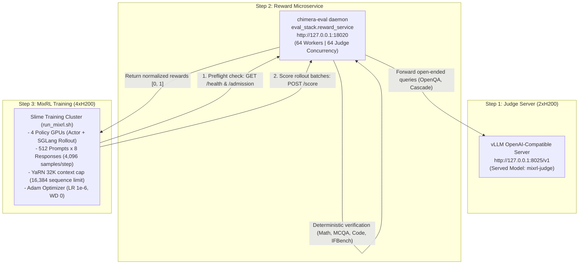

# Chimera 10B Adam MixRL: Airgapped / Production Run Guide

This guide provides the complete, production-verified instructions for launching Chimera 10B Adam MixRL on an **airgapped / no-internet** multi-GPU machine using local volume mounts, the local vLLM judge server, and the unified entrypoint script [`run_mixrl.sh`](run_mixrl.sh).

---

## 1. Architecture & Service Topology

In an airgapped environment, no external internet access or Hugging Face Hub calls are made. All inter-service communications execute over local network sockets (`127.0.0.1`):



---

## 2. Host Filesystem Directory Structure (`/data`)

Before launching containers, ensure the host directory tree under `/data` is structured as follows:

```
/data/
├── models/
│   └── chimera-muon-nemotron-105k-yarn32k-iter3478/
│       ├── hf/                             # config.json, 5 safetensors shards, tokenizer
│       └── mcore/                          # iter_0003478/, run_config.yaml, latest_checkpointed_iteration.txt
├── datasets/
│   └── chimera-eval-data/
│       ├── manifest.json                   # Frozen dataset inventory
│       ├── splits/
│       │   ├── rl_train.jsonl              # 86,647 training records
│       │   └── rl_val.jsonl                # 128 quick-monitoring records
│       └── audits/
│           └── apps/                       # summary.json + 1,376 audited APPS JSON records (197 quarantined)
├── repos/
│   ├── slime/                              # Clean checkout on branch 'chimera' (run_mixrl.sh)
│   ├── transformers/                       # Pinned Chimera Transformers package
│   └── chimera-eval/                       # Evaluator repo (eval_stack.reward_service)
├── cache/
│   └── scorer_cache/                       # Persistent scoring cache
└── runs/                                   # Training output (checkpoints, tensorboard, logs)
```

> [!IMPORTANT]
> Ensure `/data/datasets/chimera-eval-data/audits/apps` is a **real directory** containing `summary.json` and the 1,376 audit JSON files (not a broken host symlink), so it resolves cleanly within container volume mounts.

---

## 3. Step-by-Step Launch Procedure

### Step 1: Verify the Local Judge Server
The judge model is assumed to already be running on 2×H200 GPUs at port `8025`:

```bash
# Verify judge readiness and model identity:
curl -s http://127.0.0.1:8025/v1/models | jq .
```
*(Ensure `"id": "mixrl-judge"` is listed in the models array).*

---

### Step 2: Start the Reward Microservice Daemon (`chimera-eval`)
The reward microservice bridges Slime rollouts with deterministic evaluation graders and the local vLLM judge. To eliminate scoring bottlenecks across the 4,096-sample batch ($512 \times 8$), run it with **64 worker processes** and **64 judge concurrency slots**:

```bash
docker run -d --name chimera-reward-service \
  --net=host \
  --ipc=host \
  --restart=unless-stopped \
  -v /var/run/docker.sock:/var/run/docker.sock \
  -v /data/repos/chimera-eval:/opt/chimera-eval \
  -v /data/datasets/chimera-eval-data:/data/datasets/chimera-eval-data \
  -v /data/cache/scorer_cache:/data/cache/scorer_cache \
  -w /opt/chimera-eval \
  --entrypoint python3 \
  -e JUDGE_URL=http://127.0.0.1:8025/v1 \
  -e JUDGE_NAME=mixrl-judge \
  -e JUDGE_CONTEXT=16384 \
  -e JUDGE_MAX_TOKENS=1024 \
  -e JUDGE_MAX_RETRY_TOKENS=2048 \
  -e JUDGE_CONCURRENCY=64 \
  -e JUDGE_CHAT_TEMPLATE_KWARGS='{"enable_thinking":false}' \
  suryavikram6/chimera-eval:0.1.1 \
  -m eval_stack.reward_service \
    --data-dir /data/datasets/chimera-eval-data \
    --cache-dir /data/cache/scorer_cache \
    --host 127.0.0.1 \
    --port 18020 \
    --workers 64 \
    --judge-revision "mixrl-judge"
```

#### Why Each Flag is Required:
* `--entrypoint python3` & `-w /opt/chimera-eval`: Overrides the default CLI entrypoint (`run_eval.sh`), ensuring Python invokes `eval_stack.reward_service` directly without argument errors.
* `-v /data/repos/chimera-eval:/opt/chimera-eval`: Mounts the repository containing `reward_service.py`.
* `-v /var/run/docker.sock:/var/run/docker.sock`: Allows `chimera-eval` to spin up isolated container sandboxes to execute untrusted model-generated Python code for the `apps` domain safely.
* `--workers 64`: Runs 64 parallel OS worker processes so that 4,096 samples are scored in parallel without queue lag.
* `JUDGE_CONCURRENCY=64`: Dispatches up to 64 concurrent async streams to the 2×H200 judge server.
* `--net=host`: Enables direct localhost socket communication with zero network NAT overhead.

#### Verify Reward Service Readiness:
```bash
# Health check:
curl -s http://127.0.0.1:18020/health
# Expected: {"protocol_id": "...", "status": "ready"}

# Admission check:
curl -s http://127.0.0.1:18020/admission | head -c 200
# Expected: {"protocol_id": "...", "excluded_rows": {...}}
```

---

### Step 3: Launch the Slime Training Container
Launch the pinned Slime Docker container with 4 dedicated policy GPUs (devices 0, 1, 2, 3), host networking, unbounded memlock, and mounted volumes:

```bash
docker run -it --rm \
  --gpus '"device=0,1,2,3"' \
  --ipc=host \
  --net=host \
  --ulimit memlock=-1 \
  --ulimit stack=67108864 \
  -v /data/models/chimera-muon-nemotron-105k-yarn32k-iter3478:/data/models/chimera-muon-nemotron-105k-yarn32k-iter3478:ro \
  -v /data/datasets/chimera-eval-data:/data/datasets/chimera-eval-data:ro \
  -v /data/repos/transformers:/workspace/transformers:ro \
  -v /data/repos/slime:/workspace/slime \
  -v /data/runs:/data/runs \
  -w /workspace/slime \
  suryavikram6/slime:pinned \
  bash
```

---

### Step 4: Execute Zero-FLOP Dry Run Verification
Inside the Slime container, **always perform a zero-FLOP dry-run first**:

```bash
cd /workspace/slime
DRY_RUN=1 bash run_mixrl.sh
```

This verification step completes in ~15–20 seconds and verifies:
1. **Airgapped Invariants:** `HF_HUB_OFFLINE=1` and `TRANSFORMERS_OFFLINE=1`.
2. **Checkpoint SHA256 Hashes:** Validates all 20 GB of safetensors and MCore shards.
3. **YaRN RoPE Configuration:** Confirms factor 4.0, max position 32,768, and sequence cap 16,384.
4. **Multi-Domain Quotas:** Verifies all 16 training domains sum to 512 ($512 \times 8 = 4,096$ samples, divisible by 4 GPUs).
5. **Reward Service Connection:** Performs handshake with `127.0.0.1:18020/health` and queries admission quotas.
6. **Automatic Upstream Patches:** Confirms Megatron YaRN TE CUDA-graph patch and SGLang routing capture patch are applied.
7. **Expected Output:**
   ```
   Megatron actor: dense-DP=4, expert-DP=4, TP=PP=CP=ETP=1, EP=1, distributed optimizer
   SGLang rollout: 4 independent TP=1 engines, mode=sync colocate=1
   mixrl batch: 512 prompts x 8 responses = 4096 samples
   Dry run only: command/manifests written; no Ray services or training started.
   ```

---

### Step 5: Launch Production Training
Once the dry-run passes with exit code 0, launch actual training:

```bash
bash run_mixrl.sh
```

---

## 4. Step 1 Monitoring & Health Checklist

During rollout 1 and optimizer step 1, verify the following telemetry in the terminal and `$RUNS_ROOT/$RUN_NAME/`:

1. **Frozen Router Invariants:**
   Verify that `router.weight` and `router.bias` maintain `param.grad is None` and zero mutation before and after the optimizer step (< 1ms execution time).
2. **Scoring Concurrency:**
   All 4,096 samples should complete scoring in **< 10 seconds** across the 64 workers (deterministic domains finish in < 0.5s; judge domains pipeline in ~4–6s).
3. **Importance Weight Distribution:**
   Check logged pre-clip importance ratio quantiles (P10, P50, P90, P99). The fraction clipped at `[0.2, 5.0]` should remain < 5%.
4. **VRAM Headroom:**
   Check `$RUNS_ROOT/$RUN_NAME/logs/gpu_metrics.csv` to confirm peak memory stabilizes around **~82 GiB / 141 GiB** on each H200 GPU.
5. **In-Run Validation:**
   Quick evaluation runs automatically on `rl_val` (128 prompts $\times$ 4 responses = 512 samples, binary pass@4) every 10 rollout boundaries.

---

## 5. Execution Modes & Configuration Overrides

You can customize variables at the top of [`run_mixrl.sh`](run_mixrl.sh) or provide inline environment variable overrides:

### A. Resuming an Interrupted Run
To resume exact optimizer, scheduler, and route sampling state from a previous checkpoint:
```bash
RESUME=1 RUN_NAME=my-previous-run-name bash run_mixrl.sh
```

### B. Custom Rollout Length or Evaluation Cadence
```bash
NUM_ROLLOUT=200 \
EVAL_INTERVAL=20 \
bash run_mixrl.sh
```

---

## 6. Monitoring & Telemetry Artifacts

While training is active, artifacts and metrics are written to `/data/runs/$RUN_NAME/`:

* **TensorBoard:**
  ```bash
  tensorboard --logdir /data/runs/$RUN_NAME/tensorboard --port 6006
  ```
* **Hardware Telemetry:**
  `/data/runs/$RUN_NAME/logs/gpu_metrics.csv` records GPU utilization, memory usage, and power draw every 5 seconds.
* **Evaluation Summaries:**
  Every `EVAL_INTERVAL` boundaries, quick evaluation evaluates 128 prompts from `rl_val` (pass@4). Results and domain breakdowns are saved in `/data/runs/$RUN_NAME/rollouts/`.

---

## 7. Troubleshooting & Common Pitfalls

| Symptom | Cause | Solution |
| :--- | :--- | :--- |
| `cli.py: error: argument command: invalid choice: 'python3'` | `chimera-eval` image has default CLI entrypoint | Include `--entrypoint python3 -w /opt/chimera-eval` in `docker run`. |
| `FileNotFoundError: .../audits/apps/summary.json` | Dataset mount lacks the APPS audit directory or uses an unmounted host symlink | Ensure `/data/datasets/chimera-eval-data/audits/apps/` is a real, self-contained directory containing `summary.json` and 1,376 JSON files. |
| `Configured judge model is not served` | vLLM served model name does not match `JUDGE_NAME` | Ensure vLLM serves `--served-model-name mixrl-judge` and verify via `curl http://127.0.0.1:8025/v1/models`. |
| `Cannot connect to reward service at: http://127.0.0.1:18020` | Reward container not running or port collision | Verify `docker ps`, check `docker logs chimera-reward-service`, and confirm `curl http://127.0.0.1:18020/health` returns HTTP 200. |
