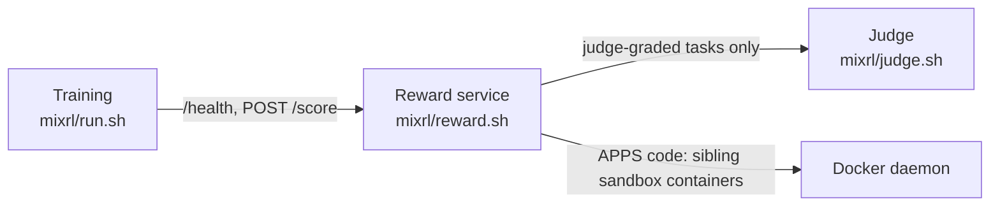

# MixRL on an airgapped machine

How to move everything onto a machine without internet and run it. The day-to-day
commands are in [`mixrl/README.md`](../README.md); every setting is in
[`mixrl/config.env`](../config.env). Paths below use the default
`BASE_DIR=/nvme_zone3/home/ekamai1/chimera/mixrl`.

---

## 1. What runs where

Three services, all talking over `127.0.0.1` on the same machine:

| Service | Started by | Default GPUs | Port |
|---|---|---|---|
| Judge (vLLM, Muse-Glimmer-30B) | `mixrl/judge.sh` (or `mixrl/run.sh start`) | `JUDGE_GPUS=4,5,6,7`: four replicas (TP 1, DP 4) | `JUDGE_PORT=8025` |
| Reward service (chimera-eval container) | `mixrl/reward.sh` (or `mixrl/run.sh start`) | none (CPU) | `REWARD_PORT=18020` (+1, ... per process) |
| Training (slime container: Megatron + SGLang) | `mixrl/run.sh start` | `TRAIN_GPUS=0,1,2,3` | none |



The judge is only needed when an enabled task uses it (`mixrl/run.sh tasks` shows
which). Training refuses to start, naming the task, if one needs a judge that is down.
The judge can run on another machine: set `JUDGE_HOST` to an address both machines can
reach, and start `mixrl/judge.sh` there.

---

## 2. Docker Images: Pull, Package, Transfer & Load

Follow these exact commands to prepare and load the Docker images on the airgapped node.

### A. On Connected Workstation (with Internet)

1. **Pull the images**. The slime image is published as `slimerl/slime`; pull it by digest
   and tag it with the name `mixrl/config.env` uses (`SLIME_IMAGE`):
   ```bash
   docker pull slimerl/slime@sha256:f7f8ee9acde9645a6e88f0c703597e69a58d2892abff56071630c88f23d5068f
   docker tag slimerl/slime@sha256:f7f8ee9acde9645a6e88f0c703597e69a58d2892abff56071630c88f23d5068f suryavikram6/slime:pinned
   docker pull suryavikram6/chimera-eval:0.1.1
   docker pull vllm/vllm-openai:muse-glimmer   # (optional: only if running judge via Docker)
   ```
   (The same digest is also tagged `slimerl/slime:nightly-dev-20260810a-cu129`; the digest pins it.)

2. **Save / Tar the images**:
   ```bash
   # Uncompressed tarballs:
   docker save suryavikram6/slime:pinned -o slime-pinned.tar
   docker save suryavikram6/chimera-eval:0.1.1 -o chimera-eval-0.1.1.tar
   docker save vllm/vllm-openai:muse-glimmer -o vllm-glimmer.tar

   # OR fast compressed tarballs with gzip:
   docker save suryavikram6/slime:pinned | gzip > slime-pinned.tar.gz
   docker save suryavikram6/chimera-eval:0.1.1 | gzip > chimera-eval-0.1.1.tar.gz
   docker save vllm/vllm-openai:muse-glimmer | gzip > vllm-glimmer.tar.gz
   ```

### B. On Airgapped Host (Target Machine)

1. **Load the images into local Docker daemon**:
   ```bash
   # From uncompressed tarballs:
   docker load -i slime-pinned.tar
   docker load -i chimera-eval-0.1.1.tar
   docker load -i vllm-glimmer.tar

   # OR from compressed tarballs:
   docker load -i slime-pinned.tar.gz
   docker load -i chimera-eval-0.1.1.tar.gz
   docker load -i vllm-glimmer.tar.gz
   ```

2. **Verify local Docker images**:
   ```bash
   docker images --format "table {{.Repository}}:{{.Tag}}\t{{.ID}}\t{{.Size}}" | grep -E "slime|chimera-eval|vllm"
   ```

   Expected output:
   ```text
   suryavikram6/slime:pinned          <image-id>   ~67GB
   suryavikram6/chimera-eval:0.1.1    <image-id>   ~1.3GB
   vllm/vllm-openai:muse-glimmer      <image-id>   # only if JUDGE_USE_DOCKER=1
   ```

| Image | Size | Used by |
|---|---|---|
| `suryavikram6/slime:pinned` | ~67 GB | `mixrl/run.sh` (preflight, start, resume) |
| `suryavikram6/chimera-eval:0.1.1` | ~1.3 GB | `mixrl/reward.sh`, and as the APPS code sandbox (`--network none --read-only`) |
| `vllm/vllm-openai:muse-glimmer` | | `mixrl/judge.sh` only with `JUDGE_USE_DOCKER=1` |

---

## 3. Dataset Download & Transfer (from Hugging Face)

The dataset repository is public: `surya-vikram/chimera-eval-data` at pinned revision `9f204f733a762c3766407636e1fbb4f8aa41dc9e` (quality-v5-clean: removes 1,094 rl_train/rl_val rows no response can pass, which training already excluded, and strips leftover markdown from science references; main_test unchanged; the removed rows are listed in `removed_rows.json`. Previous v4 revision `ed33098918e42c0f024341a7f5984b5b76262051`).

### A. Download on Connected Workstation

1. **Install the CLI and (optionally) log in**. The dataset is public, so no login is required,
   but anonymous downloads of its 1,189 files hit Hugging Face rate limits and retry; a token avoids that:
   ```bash
   pip install -U huggingface_hub
   hf auth login   # optional
   ```

2. **Download the pinned dataset v5 snapshot** (all files: manifest, splits, APPS audit; about 531 MB, a few minutes):
   ```bash
   # Using Hugging Face CLI:
   hf download surya-vikram/chimera-eval-data \
     --repo-type dataset \
     --revision 9f204f733a762c3766407636e1fbb4f8aa41dc9e \
     --local-dir ./chimera-eval-data
   ```

   *Alternatively, via Python:*
   ```python
   from huggingface_hub import snapshot_download

   snapshot_download(
       repo_id="surya-vikram/chimera-eval-data",
       repo_type="dataset",
       revision="9f204f733a762c3766407636e1fbb4f8aa41dc9e",
       local_dir="./chimera-eval-data"
   )
   ```

3. **Archive into a tarball** (about 122 MB; skips the `.cache/` download metadata the CLI leaves behind):
   ```bash
   tar --exclude=.cache -czf chimera-eval-data.tar.gz -C ./chimera-eval-data .
   ```

### B. Extract on Airgapped Host

1. **Extract into target directory**:
   ```bash
   mkdir -p /nvme_zone3/home/ekamai1/chimera/mixrl/datasets/chimera-eval-data
   tar -xzf chimera-eval-data.tar.gz -C /nvme_zone3/home/ekamai1/chimera/mixrl/datasets/chimera-eval-data
   ```

2. **Verify Dataset Structure & APPS Code Audit**:
   ```bash
   ls -la /nvme_zone3/home/ekamai1/chimera/mixrl/datasets/chimera-eval-data/
   ```
   Must contain:
   * `manifest.json` (dataset manifest)
   * `splits/rl_train.jsonl` (85,175 training records)
   * `splits/rl_val.jsonl` (506 validation records; the task file expects this v5 split)
   * `splits/main_test.jsonl` (3,982 test records)
   * `audits/apps/` (must be a real directory containing `summary.json` and 1,179 audited problem JSONs)

3. **Verify counts and content hashes** (plain `python3`; the slime helpers used here need no extra packages):
   ```bash
   D=/nvme_zone3/home/ekamai1/chimera/mixrl/datasets/chimera-eval-data
   wc -l $D/splits/*.jsonl       # 3982 main_test, 85175 rl_train, 506 rl_val
   ls $D/audits/apps | wc -l     # 1180 (1,179 problems + summary.json)
   cd /nvme_zone3/home/ekamai1/chimera/mixrl/repos/slime
   python3 -c "from slime_plugins.chimera_mixrl.core import load_split; [load_split('$D', s) for s in ('rl_train', 'rl_val')]; print('splits match manifest')"
   python3 -m slime_plugins.chimera_mixrl.tasks   # task table; preflight also checks each task's pools against this data
   ```

   > [!IMPORTANT]
   > Ensure `/nvme_zone3/home/ekamai1/chimera/mixrl/datasets/chimera-eval-data/audits/apps` is a **real directory** and not an external symlink.

---

## 4. Host layout

`mixrl/config.env` expects this under `$BASE_DIR`:

```
$BASE_DIR/
├── models/
│   ├── chimera-muon-nemotron-105k-yarn32k-iter3478/   # MODEL_NAME
│   │   ├── hf/          # config.json, safetensors shards, tokenizer
│   │   └── mcore/       # iter_*/, latest_checkpointed_iteration.txt
│   ├── Muse-Glimmer-30B/            # JUDGE_MODEL_DIR (judge weights)
│   └── Muse-Glimmer-30B-assistant/  # optional DFlash drafter, used when present
├── datasets/chimera-eval-data/      # DATASET_NAME (section 3)
├── repos/
│   ├── slime/            # this repo (branch chimera); run commands from here
│   ├── chimera-eval/     # EVAL_REPO: reward service code
│   └── transformers/     # TRANSFORMERS_DIR: Chimera transformers checkout
├── cache/                # scorer_cache/, vllm_cache/ (created automatically)
└── runs/chimera/mixrl/   # one folder per run (created automatically)
```

The slime repo can live anywhere; `mixrl/run.sh` mounts the checkout it is run from.
Deploy slime and chimera-eval at matching commits: training reads the reward
service's `/health` fields.

**Transferring the repos** (all three are public; about 53 MB packed). Clones keep the
commit, which each run records in `manifests/`:

```bash
# Connected workstation
git clone --depth 1 --branch chimera https://github.com/surya-vikram/slime.git
git clone --depth 1 --branch main    https://github.com/surya-vikram/chimera-eval.git
git clone --depth 1 --branch chimera https://github.com/surya-vikram/transformers.git
tar -czf mixrl-repos.tar.gz slime chimera-eval transformers

# Airgapped host
mkdir -p $BASE_DIR/repos
tar -xzf mixrl-repos.tar.gz -C $BASE_DIR/repos
```

GitHub "Download ZIP" copies also work: unzip them into `repos/` and rename
`slime-chimera` to `slime`, `chimera-eval-main` to `chimera-eval` and
`transformers-chimera` to `transformers`. Runs then record the commit as unknown;
`manifests/mixrl_source.tar` still holds the exact MixRL source.

---

## 5. Running

```bash
cd $BASE_DIR/repos/slime
mixrl/run.sh tasks             # optional preview: prompts per step, eval size, judge use
mixrl/run.sh start gsm8k-01    # judge (if needed and not up) -> reward service (if not up) -> tasks -> preflight -> training
mixrl/run.sh resume gsm8k-01   # after an interruption (reuses running services, no preflight)
```

`start` prints one line per step and stops at the first failure with the end of that step's
log; the preflight checks everything except the GPUs in the real container (~minutes: it
hashes checkpoints). Running services are reused: after changing judge or reward settings,
restart them with `mixrl/judge.sh` / `mixrl/reward.sh` (or stop them with `... stop`).
`resume` needs optimizer state in the checkpoints, which the default `NO_SAVE_OPTIM=0` saves
(~130 GB each, every `SAVE_INTERVAL`=20 steps: delete old `checkpoints/iter_*` as the run goes),
and the settings and code the run started with (don't update the repo mid-run). To train past `NUM_ROLLOUT`:
`NUM_ROLLOUT=500 MIXRL_EXTEND_CONSTANT_HORIZON=1 mixrl/run.sh resume gsm8k-01`.

Choose tasks in `mixrl/tasks.json` and settings in `mixrl/config.env` (or on the command
line: `LR=2e-6 mixrl/run.sh start run-b`). Stop cleanly at a step boundary with
`MIXRL_WALLCLOCK_SECONDS` or `MIXRL_STOP_FILE`.

---

## 6. Outputs and monitoring

Everything for a run is in `$BASE_DIR/runs/chimera/mixrl/<RUN_NAME>/`:

| Path | Contents |
|---|---|
| `logs/train.log` | everything the run printed, from launch to exit; search `MIXRL_STEP` (step time), `MIXRL_COLLECTION` (rewards), `MIXRL_TRAIN` (loss, grad norm), `MIXRL_ROUTER` (expert load), `MIXRL_EVAL`, `MIXRL_FAILURE`; all lines in [`mixrl/README.md`](../README.md#watching-a-run) |
| `logs/console.log`, `logs/metrics.jsonl` | the concise terminal view (one line per step with step time and ETA, rollout progress, evals, warnings, errors) and every MIXRL_* record as JSON lines |
| `logs/reward_service.log`, `logs/judge.log` | the reward service (settings, a stats line a minute, failed requests) and judge output during the run |
| `logs/judge_start.log`, `logs/reward_start.log`, `logs/preflight.log`, `logs/tasks.txt` | what `start` did before training |
| `logs/ray_logs-*.tar.gz` | Ray's internal logs, saved at exit (worker kills, raylet errors) |
| `logs/gpu_metrics.csv` | GPU utilization, memory and power every 5 s |
| `rollouts/train-N/` | per-step `metrics.json`, `timing.json`, `collection.jsonl`; each response's file (tokens, log-probs, expert routes, top-p sets; MBs each) only with `MIXRL_KEEP_TRAIN_SAMPLES=1` |
| `rollouts/eval-*/evaluation.json` | per-task and per-domain eval scores |
| `checkpoints/` | Megatron checkpoints (every `SAVE_INTERVAL` steps and at the end) |
| `manifests/` | exactly what ran: `config.env`, `tasks.json`, resolved `mixrl_config.json`, source snapshot, command |
| `tensorboard/` | `tensorboard --logdir <run>/tensorboard` |

In the first steps, check that the router stays frozen (a changed `router.weight`/`router.bias`
stops training with an error) and its load stays flat (`MIXRL_ROUTER` `cv`, `peak`, `cold`), that
`think_rate` and capped responses (`MIXRL_COLLECTION`, `MIXRL_EVAL`) and the importance-ratio
clip fractions (`MIXRL_TRAIN`) look sane, and GPU memory headroom in `gpu_metrics.csv`.

---

## 7. Troubleshooting

| Symptom | Fix |
|---|---|
| `the judge failed during startup` (from `judge.sh`) | Its log is printed. Usually GPU memory: "KV cache is needed, which is larger than the available" means lower `JUDGE_MAX_MODEL_LEN` (keep `JUDGE_CONTEXT` at or below it) or raise `JUDGE_GPU_MEMORY_UTILIZATION`. |
| `reward service not reachable on port 18020` | Start it: `mixrl/reward.sh`; `docker logs mixrl-reward-service` shows why it stopped. |
| `needs the judge ..., but judge 'mixrl-judge' is not reachable` | Start `mixrl/judge.sh` or disable those tasks; nothing else needs restarting (the check runs at launch and before every step). |
| `cannot grade <task>: ...` from `reward.sh` | A grading dependency is missing in the reward image (e.g. Docker for APPS); fix it or disable the task. |
| `missing .../config.json (check BASE_DIR, ...)` | Paths in `mixrl/config.env` do not match the host layout (section 4). |
| `TRAIN_GPUS=... lists N GPUs but POLICY_GPUS=M` | Keep them consistent in `mixrl/config.env`. |
| `run X already exists` | Pick a new name, or `mixrl/run.sh resume X`. |
| `FileNotFoundError: .../audits/apps/summary.json` | The dataset copy lacks `audits/apps/` or it is a symlink; re-extract the section 3 tarball. |
